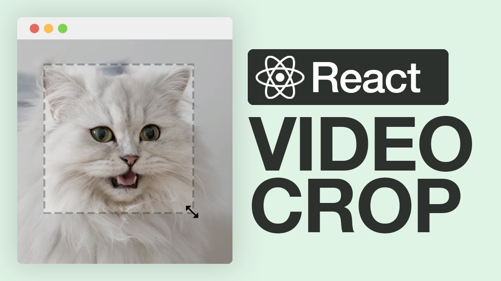

# Description

Source code for the screencast <a href="https://youtu.be/vDxZLN6FVqY" target="_blank">Build a Video Crop Tool Using React (use-gesture+react-spring)</a>

# Run Locally

- clone the repo
- run `npm install`
- run `npm run dev` 🚀

Don't forget to <a href="https://www.youtube.com/bitesizeacademy?sub_confirmation=1">subscribe</a>
